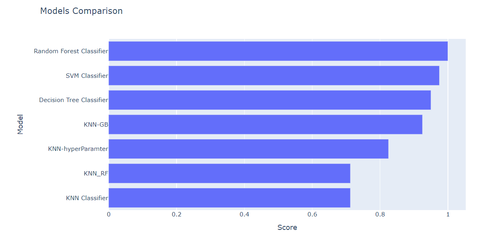

# kindey_disease_prediction
Implemented various classification algorithms like svm,rf,decision tree and knn and also performed feauture selection and hyper paramter tuning
# Chronic Kidney Disease Prediction

This project aims to predict the presence or absence of chronic kidney disease based on medical and clinical data. It employs a variety of machine learning algorithms and techniques to achieve accurate predictions.

## Description

In this project, we have used a diverse set of machine learning models, including Support Vector Machine (SVM), Random Forest (RF), Decision Tree, and K-Nearest Neighbors (KNN), to build predictive models for chronic kidney disease. Additionally, hyperparameter tuning and feature selection were applied to optimize model performance.

## Model Accuracy

Here are the accuracy scores of the models:

- SVM Classifier: 97%
- Random Forest Classifier: 100
- Decision Tree Classifier: 95
- KNN Classifier: 71%
- KNN Classifier-HYPER PARAMTER TUNING : 82%
- KNN with Feature Selection[RF]:71%
- KNN with Feature Selection[gb]: 93%

## Usage

To run the code and replicate the results, follow the instructions in the `notebooks` directory.

## Dependencies

- Python 3.x
- Scikit-Learn
- Pandas
- NumPy
- Matplotlib
- Seaborn

## Credits

This project was developed by Sanjana Singamsetty.

