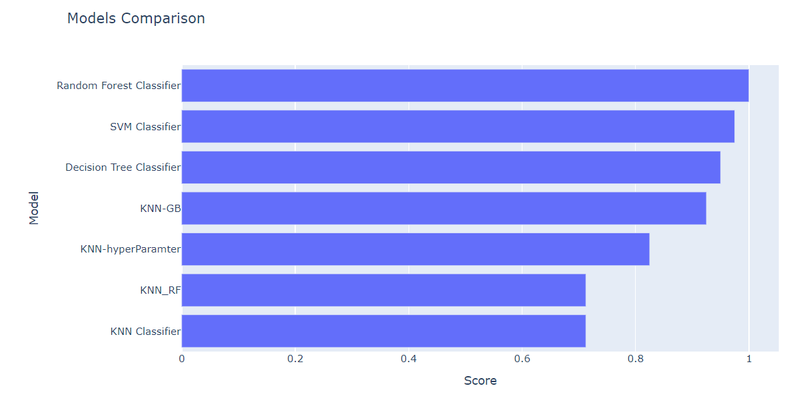

# kindey_disease_prediction
Implemented various classification algorithms like svm,rf,decision tree and knn and also performed feauture selection and hyper paramter tuning
# Chronic Kidney Disease Prediction

This project aims to predict the presence or absence of chronic kidney disease based on medical and clinical data. It employs a variety of machine learning algorithms and techniques to achieve accurate predictions.

## Description

In this project, we have used a diverse set of machine learning models, including Support Vector Machine (SVM), Random Forest (RF), Decision Tree, and K-Nearest Neighbors (KNN), to build predictive models for chronic kidney disease. Additionally, hyperparameter tuning and feature selection were applied to optimize model performance.

## Model Accuracy

Here are the accuracy scores of the models:

| Model                | Training Accuracy | Test Accuracy | Average Cross Validation Score |
|----------------------|-------------------:|--------------:|-------------------------------:|
| Random Forest        |            99.2078 |       98.9741 |                         98.81 |
| Extra Trees          |            99.6078 |       99.0741 |                         99.67 |
| LightGBM             |              99.60 |       98.1481 |                         98.08 |
| Decision Tree        |            96.4235 |       96.2963 |                         96.40 |
| Logistic Regression  |              99.20 |       99.0741 |                         98.2  |
| ANN                  |              99.00 |         97.33 |                       97.1334 |

## Usage

To run the code and replicate the results, follow the instructions in the `notebooks` directory.

## Dependencies

- Python 3.x
- Scikit-Learn
- Pandas
- NumPy
- Matplotlib
- Seaborn

## Credits

This project was developed by Sanjana Singamsetty.

