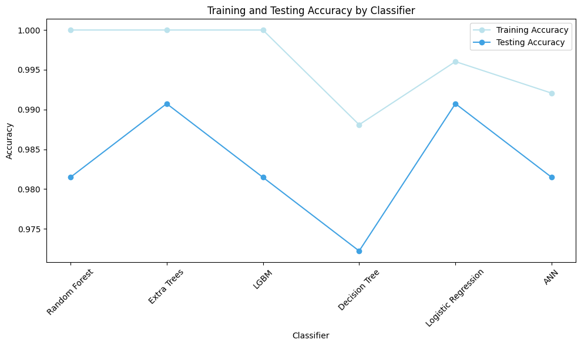

# kindey_disease_prediction
Implemented various classification algorithms like svm,rf,decision tree and knn and also performed feauture selection and hyper paramter tuning
# Chronic Kidney Disease Prediction

This project aims to predict the presence or absence of chronic kidney disease based on medical and clinical data. It employs a variety of machine learning algorithms and techniques to achieve accurate predictions.

## Description

Our Streamlit-based machine learning application offers a seamless and intuitive platform for predicting credit card default risk. Leveraging the power of machine learning algorithms, our app provides users with real-time predictions based on input features related to credit card usage and individual financial attributes.

Upon accessing the app, users are greeted with a user-friendly interface that guides them through the prediction process. They are prompted to input relevant information such as credit card limit, age, education level, marital status, and payment history. These features serve as crucial indicators for assessing creditworthiness and predicting the likelihood of default.

Behind the scenes, our application utilizes a trained machine learning model to analyze the input data and generate accurate predictions. The model is trained on a comprehensive dataset containing historical credit card usage and repayment information, ensuring robust performance and reliable predictions.

Once the user submits the required information, our app processes the data and generates a prediction regarding the likelihood of credit card default. The prediction is presented to the user in a clear and understandable format, accompanied by relevant metrics and visualizations to aid interpretation.

Furthermore, our application prioritizes transparency and user engagement by providing detailed explanations of the prediction process and the factors influencing the final outcome. Users can explore feature importance rankings and gain insights into how different variables contribute to the prediction.

With its user-friendly interface, real-time predictions, and transparent explanation capabilities, our Streamlit-based machine learning application empowers users to make informed decisions regarding credit card management and risk assessment. Whether for personal financial planning or business decision-making, our application serves as a valuable tool for predicting credit card default risk with confidence and accuracy.

## Model Accuracy

## Usage

Follow the Link and give the Input as required 
[Chronic Kidney Disease Prediction Model](https://huggingface.co/spaces/sanjana04/Chronic-kidney-disease-prediction)

This model is designed for predicting chronic kidney disease. It can be used to assess the likelihood of a patient having chronic kidney disease based on input features such as age, blood pressure, blood glucose levels, and other relevant medical indicators.

### Usage:

1. **Input Format**: Provide the necessary input features required for prediction. These may include:
   - Age
   - Blood pressure (systolic and diastolic)
   - Blood glucose levels
   - Albumin levels
   - Hemoglobin levels
   - Serum creatinine levels
   - Blood urea levels
   - Sodium and potassium levels
   - Specific gravity of urine
   - Red blood cell count
   - White blood cell count
   - Hypertension (yes/no)
   - Diabetes mellitus (yes/no)

2. **Prediction**: Once the input features are provided, the model will generate a prediction regarding the likelihood of chronic kidney disease for the patient.

3. **Interpretation**: The prediction output will indicate whether the patient is likely to have chronic kidney disease, along with any relevant confidence scores or probabilities.

This model can be used by healthcare professionals, researchers, and individuals concerned about their kidney health to aid in early detection and management of chronic kidney disease.

## Dependencies

- Python 3.x
- Scikit-Learn
- Pandas
- NumPy
- Matplotlib
- Seaborn
- Streamlit
- OS
- SHAP
- LIME

## Credits

This project was developed by Sanjana Singamsetty.

